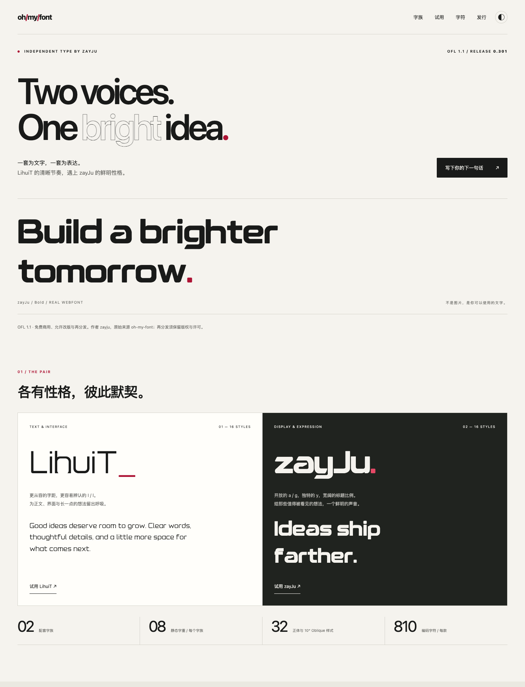

# LihuiT & zayJu

**Two voices. One bright idea.** Paired geometric sans-serif fonts by **zayju**.

[简体中文](README.zh-CN.md) · [Try the fonts](https://sheathedsharp.github.io/oh-my-font/) · [Download v0.301](https://github.com/SheathedSharp/oh-my-font/releases/tag/v0.301) · [Source & attribution](ATTRIBUTION.txt)



## Download and use

**Free for commercial use under SIL Open Font License 1.1.** No Reserved Font Names. The original author and source are included in the font metadata and every release package. Preserve the copyright notice and OFL license when redistributing the Font Software; no compulsory visible credit is added to ordinary artwork. See [license scope](LICENSE.md), [OFL.txt](OFL.txt) and [ATTRIBUTION.txt](ATTRIBUTION.txt).

Choose **TTF or OTF**, not both: they have the same desktop font identities. Choose **WOFF2** for a website. The `Website` archive contains the complete interactive specimen. Every package has license/source notices and internal hashes; Release-level `SHA256SUMS.txt`, `BUILD-MANIFEST.json` and `QA.json` bind the downloadable artifacts to their source. GitHub's automatic source archive is not the installable-font package.

## The pair

| Family | Role | Previous engineering name |
| --- | --- | --- |
| **LihuiT** | Text/interface; more generous spacing and distinguishable default I/l | Lihui |
| **zayJu** | Display; wide proportions and open a/g with separated y strokes | Zixian |

Each family has eight static weights (100, 300, 400, 500, 600, 700, 800, 900), upright and 10° Oblique: **32 styles**, each in TTF, CFF OTF and WOFF2. Each face contains **945 glyphs / 810 Unicode code points**. Author attribution remains lowercase **zayju**.

This is the first public **0.301** release, not a claim of universal typographic completion. No Han, full Greek/Cyrillic, variable axis or monospaced coding family is included. Oblique is not a separately drawn Italic. Enable `ss05` for stronger I/l differentiation in zayJu. [Verification and known limitations](docs/QA-0.301.md) explicitly preserve the remaining FontBakery findings; [issue #3](https://github.com/SheathedSharp/oh-my-font/issues/3) tracks future polish.

## Build from source

Python 3.10+; dependencies are pinned. This never installs fonts automatically.

```sh
python3 build-local.py
```

Or with your own virtual environment:

```sh
python -m pip install -r requirements.txt
python build.py
python tools/prepare_site.py
python -m http.server 8136 --bind 127.0.0.1 --directory site
```

Open `http://127.0.0.1:8136/`. The specimen uses actual WOFF2 files with explicit loading failures, missing-character warnings, all weights/Oblique, OpenType features, editable text, dark mode and responsive layouts. Outputs are under `dist/{ttf,otf,woff2}/{LihuiT,zayJu}/`.

## Verify and release

```sh
python -m pip install -r requirements-qa.txt
python tools/check_candidates.py
python tools/check_fontbakery.py
python tools/check_site.py  # local server + Google Chrome required
```

The scoped FontBakery gate runs the full profiles and accepts only the precisely matched existing Sigma coverage finding; it does not pretend the raw profiles return zero. Native macOS checks, exact QA hashes, packaging and the release/deployment procedure are documented in [docs/RELEASING.md](docs/RELEASING.md). GitHub Actions verifies Linux builds and deploys the checksum-verified Website archive from Releases rather than silently rebuilding different fonts.

## Provenance

The source comes from the owner's Lihui/Zixian engineering project. The original project and raster design boards remain untouched; see [provenance](docs/PROVENANCE.md). The build does not import or rename installed fonts. Dependencies are separately installed and retain their own licenses. OFL permission is not a guarantee of exclusive rights, perfect optical finishing or compatibility with every application.
