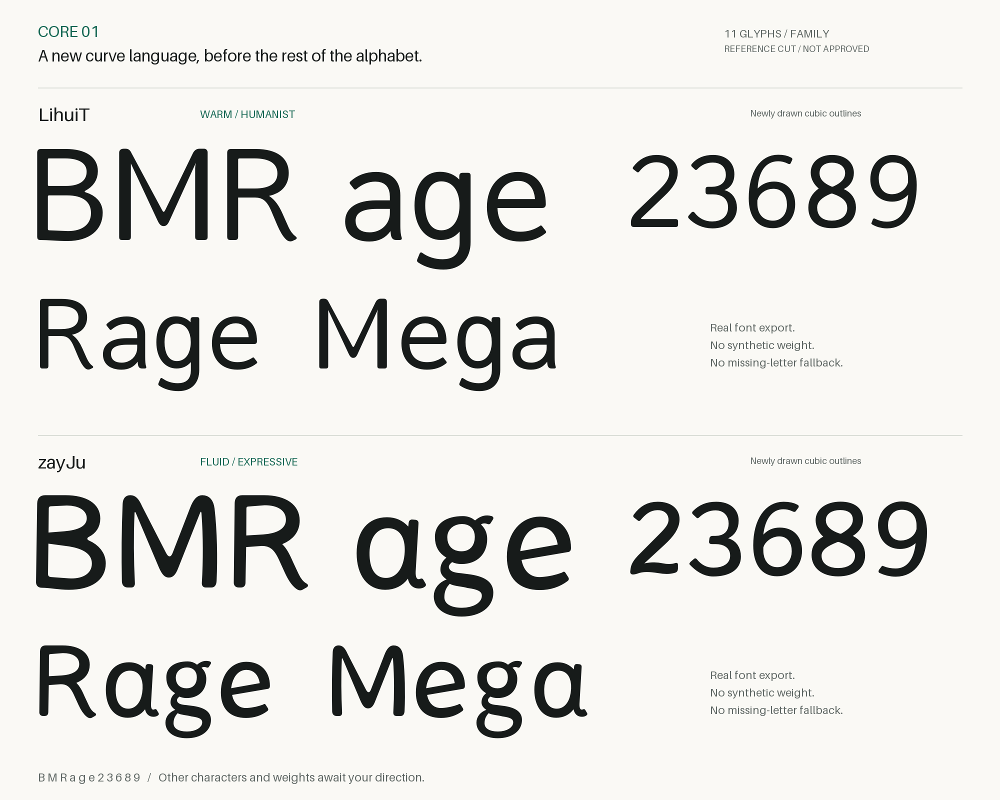
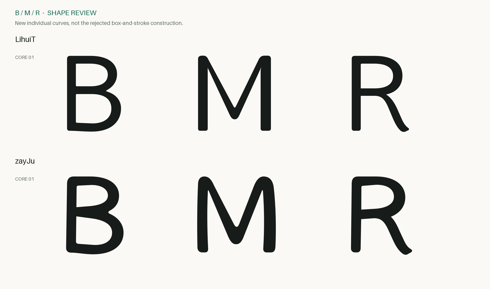
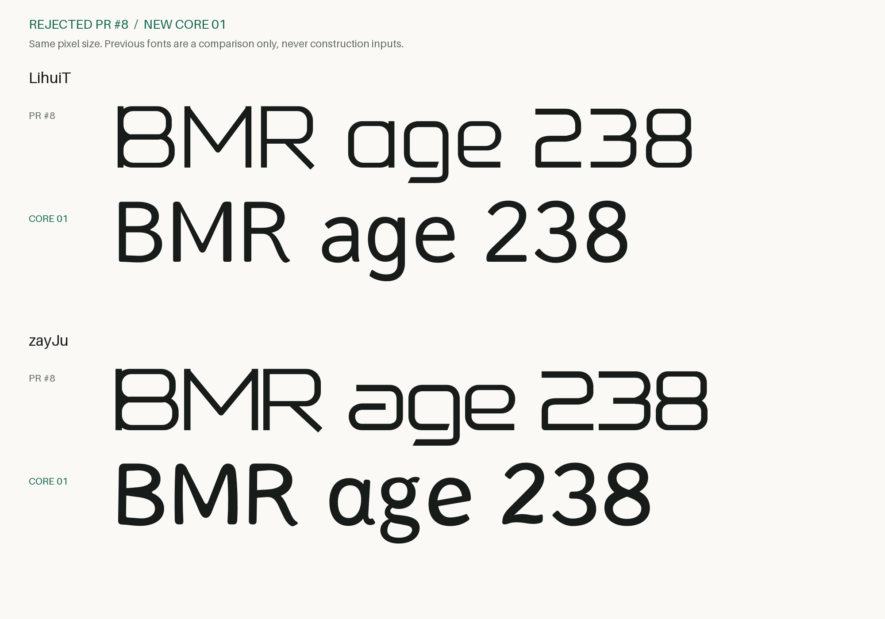

# 核心字集 01：请先验收风格

**提案状态：待验收。每款只重绘 11 个字符、一个参考切面。**
不把工程检查通过当作视觉通过，也不提前补其他字符或字重。

## 两个分别判断的方向

**LihuiT：温润的人文无衬线。** 减少方框感，保留较克制的正文气质。
B 的上碗更小、下碗更饱满；M 的谷底与肩部做了软化；R 的腿由字碗顺势
向外舒展。a 改为双层结构，g 保留单层圆眼和流畅下伸，e 打开右侧开口。

**zayJu：更有张力的流动展示体。** 不再沿用直杆和圆角盒子。B 有偏斜的
内白与收腰，M 采用弯曲立柱和更饱满的谷底，R 的腿更有摆动感。a 是单层
结构与上扬收尾；g 选择双层、偏置下环；e 的横画上扬，2 的底部带有轻微
波动，8 的两个内白并非简单上下堆叠。

这些是本次的**设计提案**，不是“已经证明更有个性”的自评。两款可以分别
接受、修改或否决；同款也可以逐字给结论，不要求一次接受整组。

## 重点放大：B / M / R

## 与被否决稿对比

上下使用相同像素字号。旧稿只用于展示差异，没有导入新 UFO 作为绘制源。
这不是相同重量黑度的科学对照；本轮仅一个参考切面，完整字重体系尚未设计。

## 查看曲线本身

`proofs/review.html` 是可离线打开的独立曲线检视页：可切换字族、输入
`Rage` / `Mega` 等受支持组合、放大单字、显示轮廓和 Bézier 控制点。
它显示 **UFO 曲线源**，而 PNG 是 **实际导出的 CFF 字体渲染**；两者不混称。
输入尚未绘制的字母会停止预览并提示，不让替代字体冒充新设计。

每个字形还有 `proofs/svg/<family>/<glyph>.svg`。主编辑源为 UFO3，每个字符
一份 GLIF，保存轮廓节点和控制点；`.glyphs` 是从同一 UFO 导出的专业编辑
副本。已核对 Glyphs → UFO 往返的轮廓与字宽，不声称在未安装的 Glyphs GUI
里进行了鼠标绘制。请只选一个源作为编辑权威，避免两份编辑分叉。

## 逐字状态

| 字符 | LihuiT | zayJu |
| --- | --- | --- |
| B | 待视觉验收 | 待视觉验收 |
| M | 待视觉验收 | 待视觉验收 |
| R | 待视觉验收 | 待视觉验收 |
| a | 待视觉验收 | 待视觉验收 |
| g | 待视觉验收 | 待视觉验收 |
| e | 待视觉验收 | 待视觉验收 |
| 2 | 待视觉验收 | 待视觉验收 |
| 3 | 待视觉验收 | 待视觉验收 |
| 6 | 待视觉验收 | 待视觉验收 |
| 8 | 待视觉验收 | 待视觉验收 |
| 9 | 待视觉验收 | 待视觉验收 |

## 检查到哪里为止

22 个核心字形均重新指定曲线形状与控制点，没有从其他字体描摹、旋转 6
得到 9，或把旧轮廓统一扩张。每款额外只有技术所需 `.notdef` 和空格，不
代表增加了两个设计字符。正式仓库 VERSION、字体、网站和原始工程均未改。

本机检查通过：26 个 UFO 技术字形；6 个 TTF / OTF / WOFF2 文件的结构、
轮廓、OTS、署名；48 组 HarfBuzz 样例；两个 Glyphs/UFO 往返；6 文件重复
构建一致。TTF/CFF 最大采样边界差为 0.661 UPM，这只是导出差异检查，
不表示视觉优劣，也不是解析意义的最大误差证明。

macOS CoreText 对 4 个桌面文件、20 行真实样例检查无缺字与 fallback；
Chrome 加载两个实际 WOFF2，检查曲线检视交互与三种屏宽。没有持久安装。
范围与 SHA-256 记录见 [qa.json](qa.json)。Linux CI 的最终状态以 PR 当前
提交上的检查为准。这不是全字族、全字重、全语言或全平台质量结论。

**到此暂停。只有核心风格得到维护者确认后，才按明确顺序逐字补齐。**
