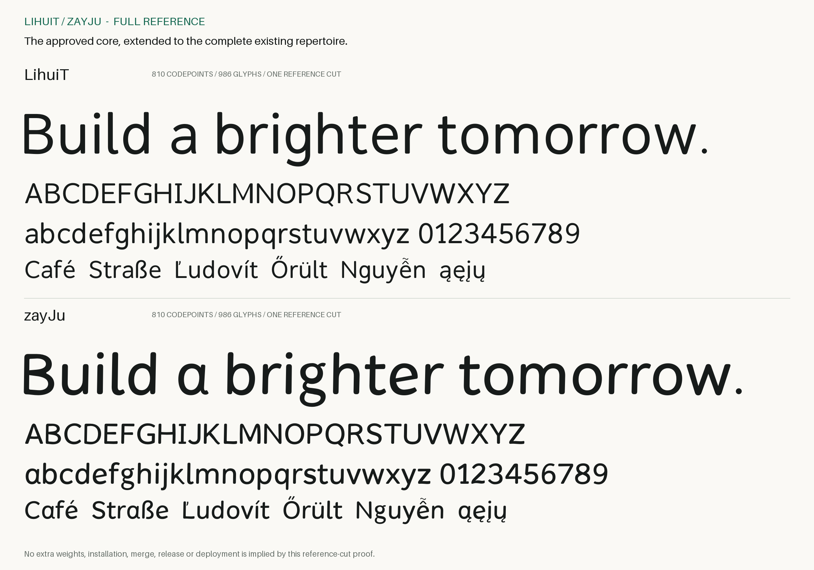
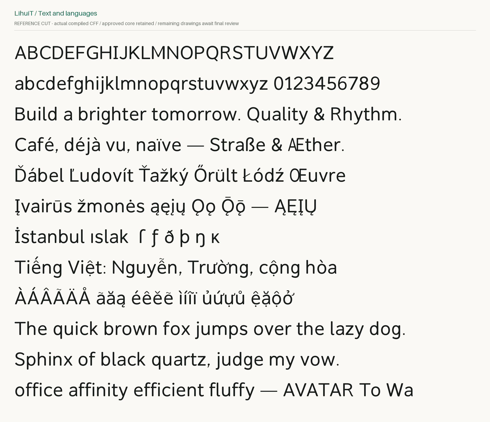
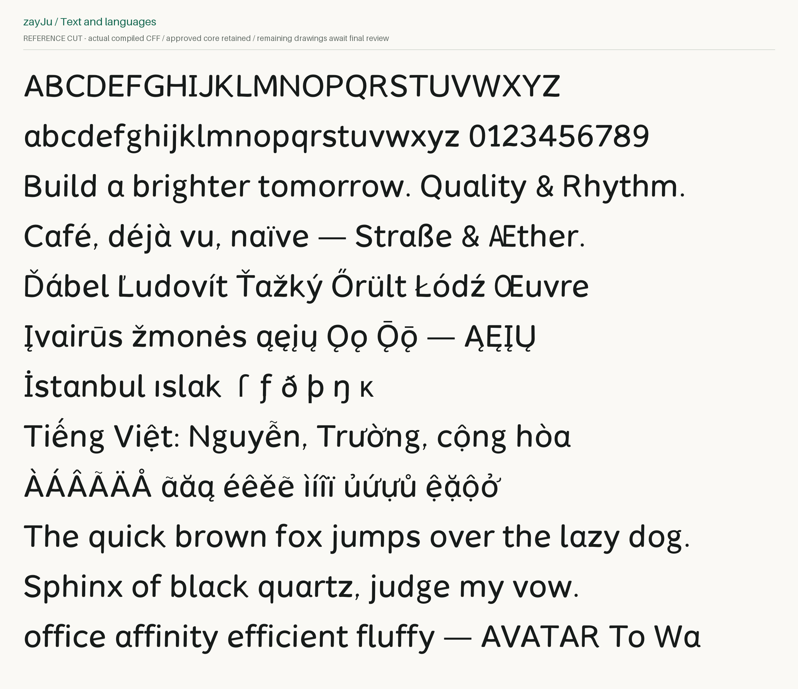
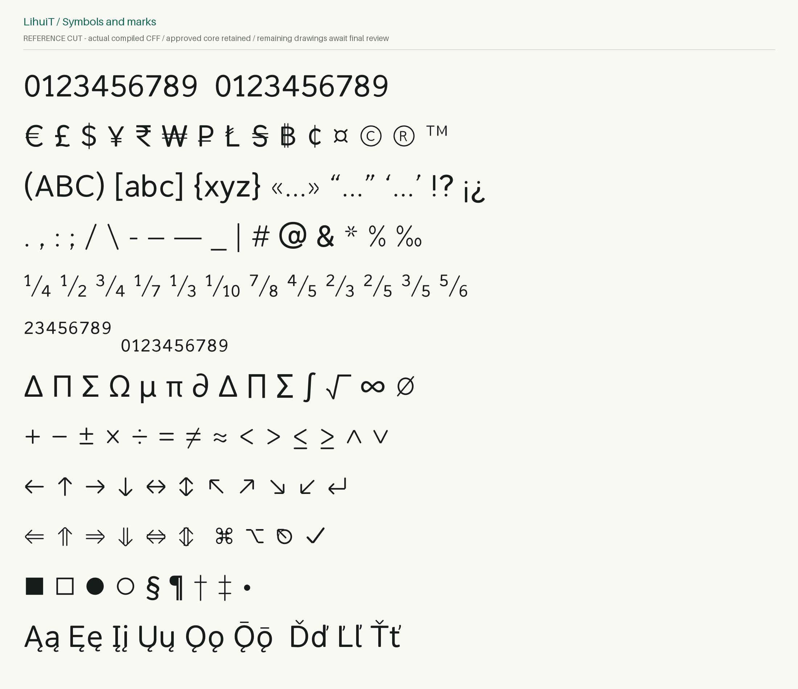
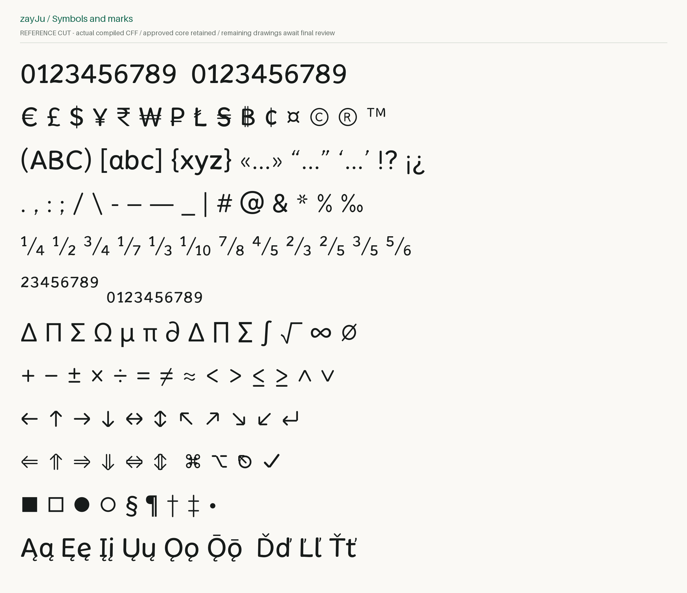
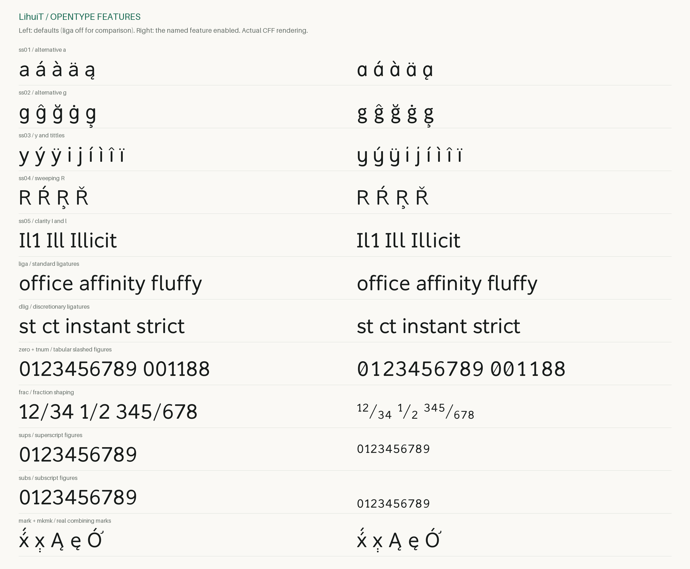
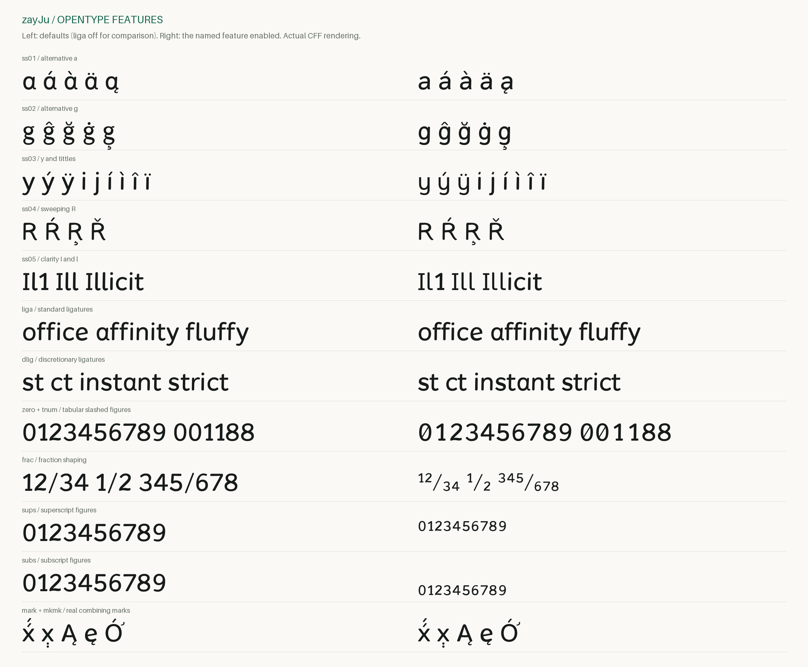

# 全字符参考稿：剩余字符已补齐，等待最终视觉审查

**两款各完成一个参考字重；不是把同一轮廓合成八个字重。**
你已通过的 Core 01 共 22 个字形，曲线、字宽及编码均保持不变。核心历史源稿
未改，完整稿中的基础形状由自动锁定检查逐项核对。

## 已补齐到什么范围

LihuiT 与 zayJu 各有 **810 个编码字符、986 个字形**。原有 945 个字形名称
全部保留；另有 41 个明确列出的无编码辅助字形：1 个右侧 caron，17 个重音
ss03 替代字形、23 个重音 ss05 清晰字形。后两类用于保证带重音文本也能正确
使用同一功能，不是凭空增加 Unicode 覆盖。精确列表见 [helper-glyphs.json](helper-glyphs.json)。

范围包括完整 A–Z / a–z / 0–9、常用标点和括号、货币与数学符号、箭头及
原有 UI 符号、原有扩展拉丁字符、组合附加符号、分数、上下标、连字和替代字形。
原有 21 个 OpenType 功能均已接到新设计，包括 kern、liga、dlig、mark、mkmk、
ss01–ss05、tnum、pnum、zero、frac 等。原始覆盖合同是 [repertoire.json](repertoire.json)，
它只用于核对名称和编码，没有导入旧字库的轮廓。

这是**原有覆盖范围的补齐**，不宣称完整希腊文、西里尔文、汉字或全部 Unicode。
重音字形采用可编辑的新基础字形组件与锚点，不冒充数百个从零手绘的独立字母。

## 本轮额外修正的实际问题

**Œ 的跨格式接合。** 首次全量检查发现 LihuiT Œ 在 TTF 与 CFF 中有 2.434793
UPM 的采样边界差。修正了构建器对变换组件、嵌套组件和整数化的处理，保持 UFO
仍可编辑，不移动已批准核心，也没有放宽 1.6 UPM 的检查阈值。

**尾钩不是悬空重音。** ą / ę / į / ų / ǫ 等字形改用独立 ogonek 接合锚点；
尾钩按字母结构连接到基础字形，而不是统一放在下方居中。默认及替代字形的对应
组合一并修正，并检查尾钩是否真正接合、是否越过不应越过的右缘。

**替代字形的重音一致性。** ss03 下的 í / ì / î / ï 等不再保留多余的原点；
ss05 的带重音 I / l 有对应清晰字形，预组合和分解输入使用相同轮廓、字宽与锚点。
检查时在内存中删除预组合 cmap 项，强制排版器走基础字母 + 附加符号，以免输入
归一化把真正的锚点问题掩盖。默认及 ss01–ss05 全部检查，不只比较字形名称。

**Command 符号。** ⌘ 中四个多余三角空洞已移除，保留四个环和中间字腔。
字体导出中的嵌套组件检查、未 hint 字体的扫描控制也已处理。扫描控制不是自动
hinting，更不代表已完成 Windows 原生显示验收。

## 实际字样

### LihuiT：字母、文字和多语言

### zayJu：字母、文字和多语言

### 数字、符号和组合附加符号

### OpenType 功能前后对照

左侧默认、右侧启用该行功能。使用实际 CFF 字体和排版引擎渲染，不是替代字体。

[全部 1,972 个导出字形图册](proofs/atlas.md)按字形名逐项展示，包括无编码功能
字形。图册为到达无编码字形临时在内存加入 PUA 映射，该映射**没有写入任何字体
或源稿，也不属于真实覆盖范围**。空格、控制字符等本来无墨迹的技术字形保持空白。

`proofs/review.html` 是可离线打开的源轮廓检视页，支持字形名、U+ 编码、单字
查询、分页、核心过滤与放大轮廓。该页显示 **UFO 源轮廓，不是浏览器文本排版**；
上面的 PNG 和独立浏览器测试才使用实际编译字体。没有查询结果时不显示替代字形。

## 最终本机验证

| 检查 | 结果 |
| --- | --- |
| 负例及回归测试 | 19 项通过；包括核心改动拒绝、缺失 / 循环组件、无效坐标、Œ、尾钩、ss03 与 ss05 |
| 源轮廓 | 1,972 个完整源字形通过；核心 22 个形状 / 字宽 / 编码锁定通过 |
| 导出轮廓和 OTS | 6 文件 × 986 字形，共 5,916 次轮廓检查；6 / 6 文件 OTS 通过 |
| 编码字符实际排版 | 4,740 次非空白字符检查通过 |
| 功能回归 | 126 个功能断言通过；每文件核对 7 个连字 caret 记录 |
| 通常的规范等价输入 | 2,964 对通过 |
| 强制分解与功能组合 | 默认 + ss01–ss05，共 17,784 对实际放置后的轮廓及字宽比较通过 |
| 跨格式 | 两款全部 1,972 对 TTF / CFF 字形通过；最大采样边界差 0.982662 UPM，小于 1.6 UPM |
| WOFF2 | 与对应 TTF 的映射、字宽、点坐标及标志无损一致 |
| Glyphs 编辑副本 | 全部字形轮廓操作、字宽、编码与锚点往返检查通过；主 UFO 不被改写 |
| 两次独立目录构建 | 6 个字体文件全部逐字节一致 |
| macOS CoreText | 4 个桌面文件、48 行多语言样例、3,160 次非空白编码映射；无缺字和 fallback，仅进程内注册 |
| Chrome | 两个真实 WOFF2 的内容哈希一致；浏览器报告多语言样例只用了预期自定义字体；检视交互及 1440 / 900 / 390 px 布局通过 |

所有结果与当前源文件、输出字体及样图的哈希绑定，见 [qa.json](qa.json)。Glyphs
文本序列化保留到小数精度，其伴随格式坐标差阈值为 0.00002 UPM；这不修改作为
权威的 UFO。跨格式边界差为采样检查，不冒充解析的最大误差证明。

Linux 的 `Verify full reference fonts` 工作流会独立重跑上述核心锁定、全量构建、
轮廓 / 排版 / 强制分解检查、FontBakery、可重复构建与 Chromium 验证。最终 CI
状态请看 PR 当前提交，不用本机结果替代 CI。

## 保留而没有隐藏的 FontBakery 结果

四组完整 universal profile 分开运行，避免把两款不同字族混成一个家族检测。
严格 scoped gate 通过，**没有未解释的新 FAIL / ERROR**。原始 profile 仍不是全绿：
保留 **4 条既有 Sigma 大小写覆盖 FAIL**（每个桌面字体一条），因为原有范围含
U+03A3 而不含 U+03C3。没有为了消除告警临时捏造新的希腊字形或扩大豁免。

另有 **8 条 WARN 检查结果**：两个 TTF 的 contour_count 与 soft_hyphen；两个
CFF 的 soft_hyphen 与 caron.right 可达性提示。完整消息、原始退出码和分类均保留。
这些提示不被统称为无害；原有 Issue #3 的更广覆盖与排版议题不在此处宣布关闭。
soft hyphen 本次保留编码但默认无墨迹、零字宽，以测试记录为准。

## 状态与下一步边界

**剩余字符的绘制、组合和工程验证已补齐；新增字形的最终视觉批准仍由维护者决定。**
完整字样中仍可能有需要进一步光学校正的单字、字号或字距，自动全量检查不能替代
逐字审美判断。主编辑源位于 `sources/*.ufo`，一字形一 GLIF；`*.glyphs` 是经过
往返检查的编辑副本，不同时维护两份分叉的绘图真源。

没有生成剩余七个字重、没有伪造斜体，也没有安装、合并、打 tag、发版或部署。
正式 `VERSION` 仍为 0.301。待这轮全字符稿验收后，再决定整合发布或独立字重设计。
