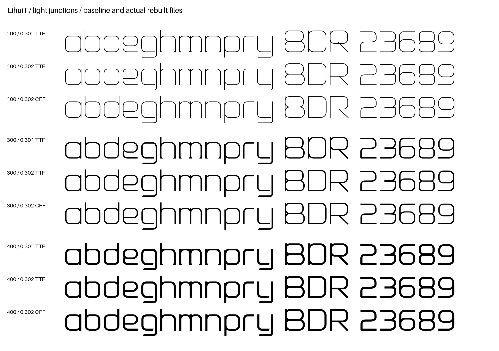
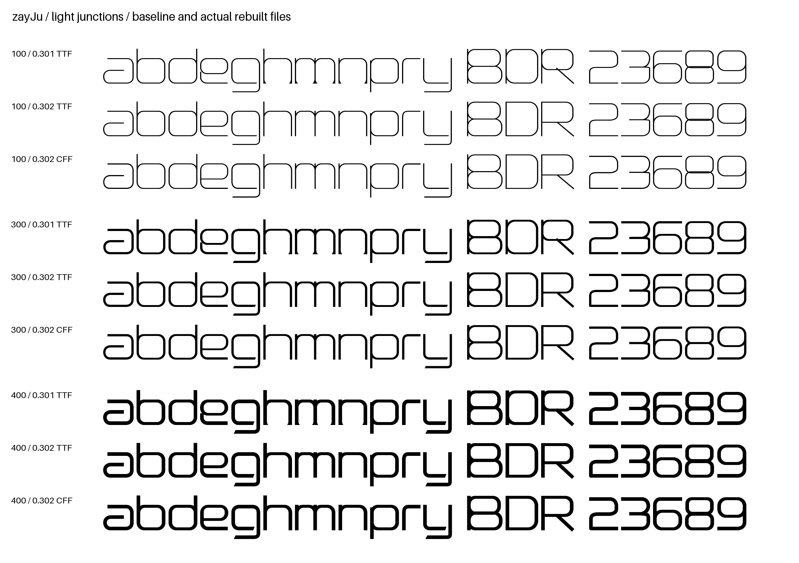
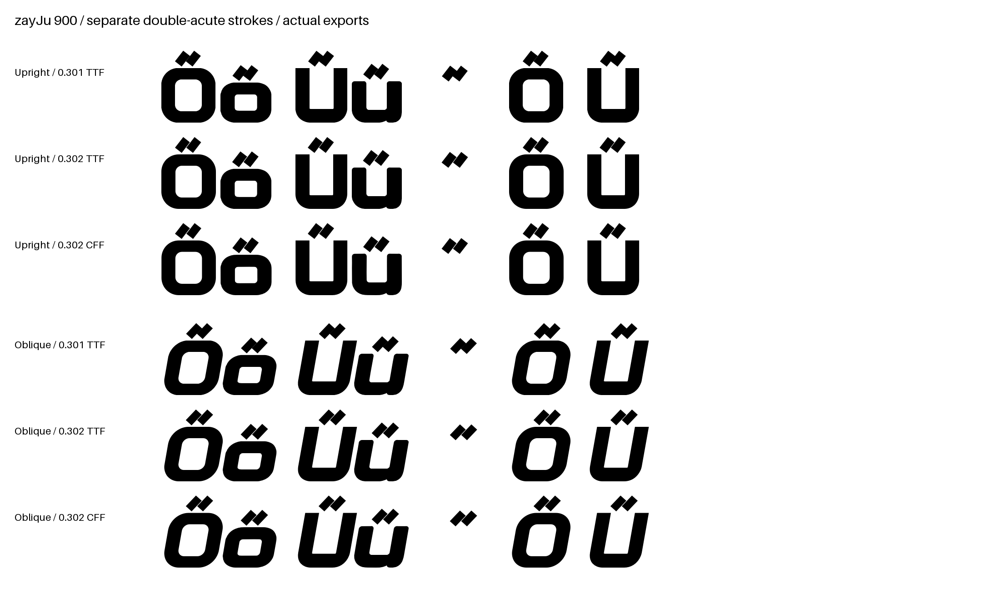
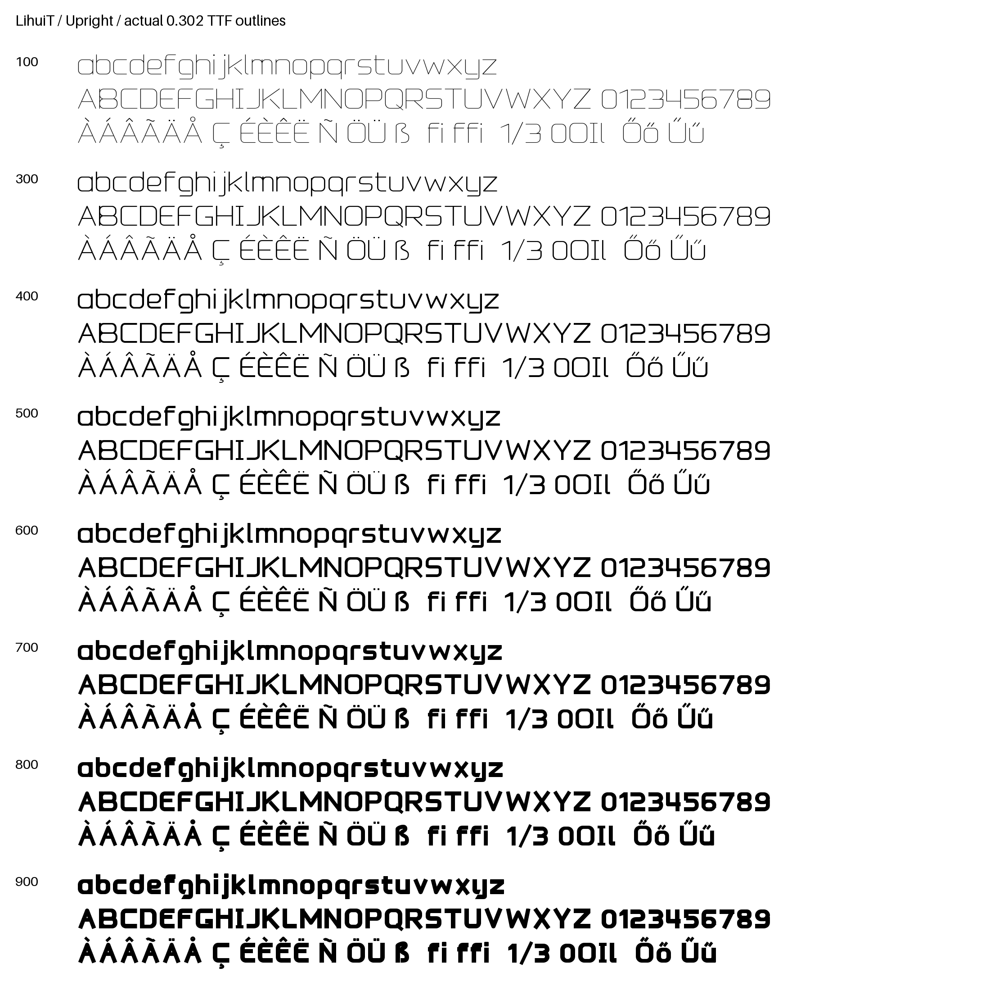
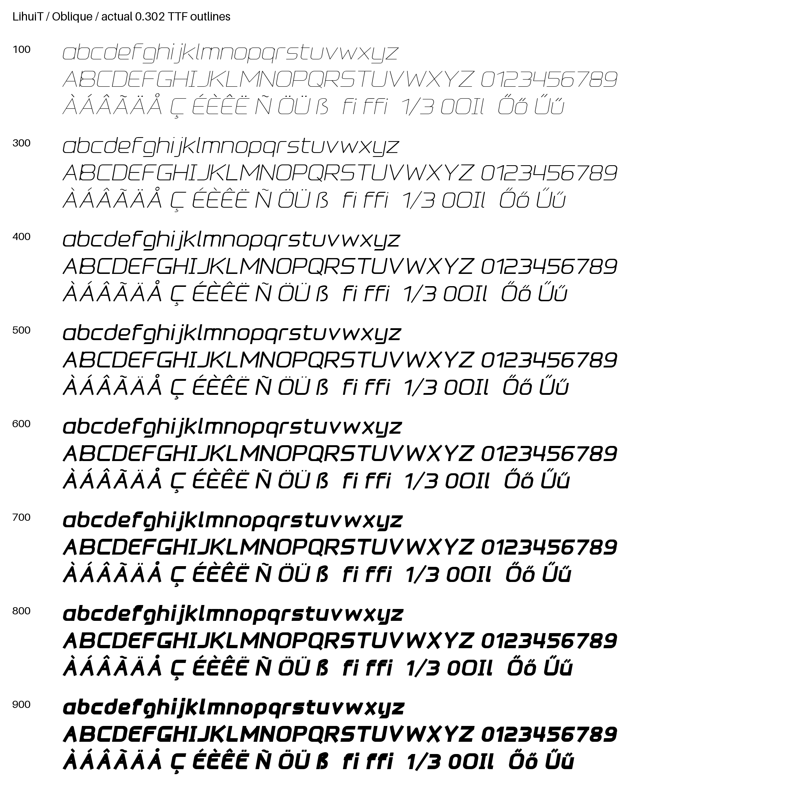
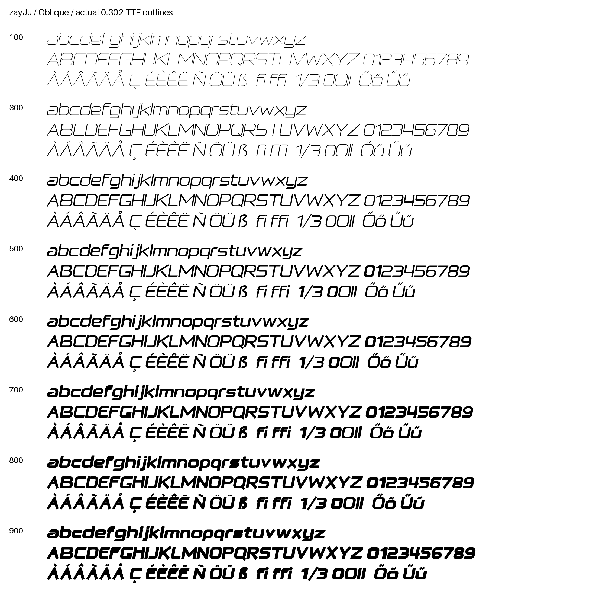

# 0.302 optical proofs / 字形修正对照

These are renders of actual compiled files, not CSS synthetic weights. Read the
[QA scope and results](../../QA-0.302.md) and [exact font hashes](proof-manifest.json).
All images show a development candidate, not an already published release.

## LihuiT 100 / 300 / 400

Each cut shows old 0.301 TTF, new 0.302 TTF, then new 0.302 CFF. Inspect e's
connection, n/m/h feet, and D/P/R junctions and counter spaces.

## zayJu 100 / 300 / 400

The characteristic open a/g/y design is retained; unwanted joint artifacts are
not treated as intentional letter features.

## zayJu 900: double-acute separation

The old merged strokes are shown against the new TTF and CFF, in upright and
Oblique. Only this weight's six associated glyph drawings were adjusted.

## Full upright and Oblique weight series

These sheets cover all 32 styles, including Latin case, digits and accented text.
They are a review sample, not an exhaustive human inspection of all 945 glyphs.

